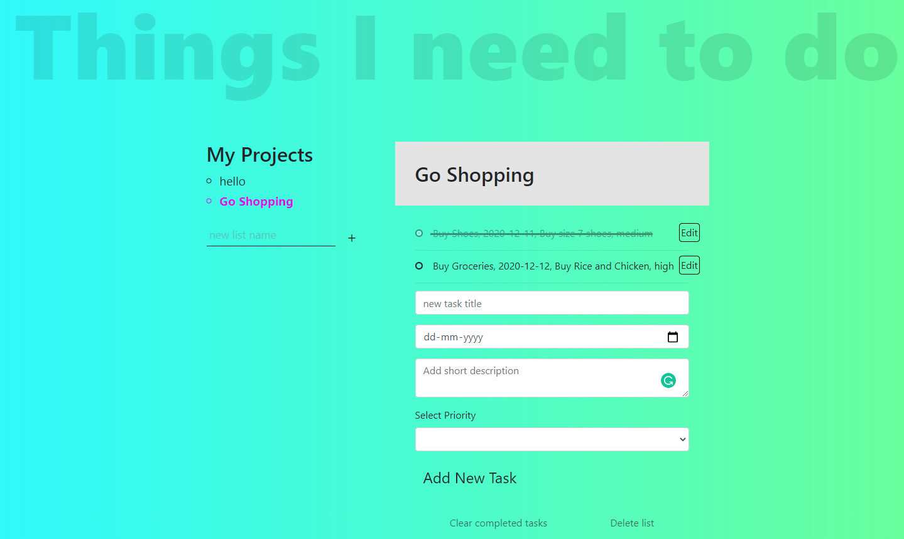

# Project: To Do List

This is a To Do List created using Javascript and Webpack. An user can add multiple projects and add multiple tasks under each project. User can add task title, task description, duedate and set the priority of the tasks. User can also update the tasks as well as remove it. The project can be deleted as well.

## Landing page



## Live Link

[Live demo](https://todo-list-todos.netlify.app/)


## Technologies used:
- JavaScript programming language
- Bootstrap
- HTML & CSS
- localStorage
- .eslintrc (for validating js code).

## Setup the project on your machine:
To contribute to this project, run the following command on your terminal:
```
git clone https://github.com/ClaytonSiby/TODO-LIST/tree/feature/todo-list-implementation
```

Once you have the cloned the project & you are still on the terminal, run:
```
cd TODO-LIST
```

And run the app on your local machine in the browser of your choice.

## Testing Setup

1. - [] Open `Terminal` 
2. - [] Run `cd TODO-LIST` to enter directory
3. - [] Run `npm run test` to start testing
4. - [] All test cases are successfully passed

## Authors

👤 ABHIGYAN Mahanta

- Github: [@Abhigyan001](https://github.com/Abhigyan001)
- Twitter: [@abhigyan_001](https://twitter.com/abhigyan_001)
- LinkedIn: [Abhigyan](https://www.linkedin.com/in/abhigyanmahanta/)

👤 Clayton Siby
- Github: [@Clayton Siby](https://github.com/ClaytonSiby)
- Twitter: [@ClaytonSiby](https://twitter.com/ClaytonSiby)
- Linkedin: [linkedin](https://www.linkedin.com/in/clayton-siby/)
- claytonsiby@gmail.com

## :handshake: Contributing

Contributions, issues and feature requests are welcome!
Feel free to check the [issues page](https://github.com/ClaytonSiby/TODO-LIST/issues).

## Show your support

Give a :star:️ if you like this project!


